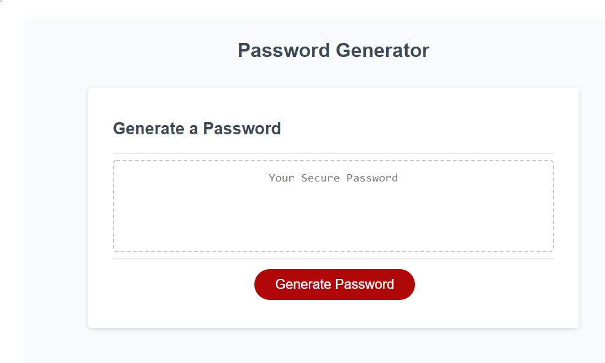
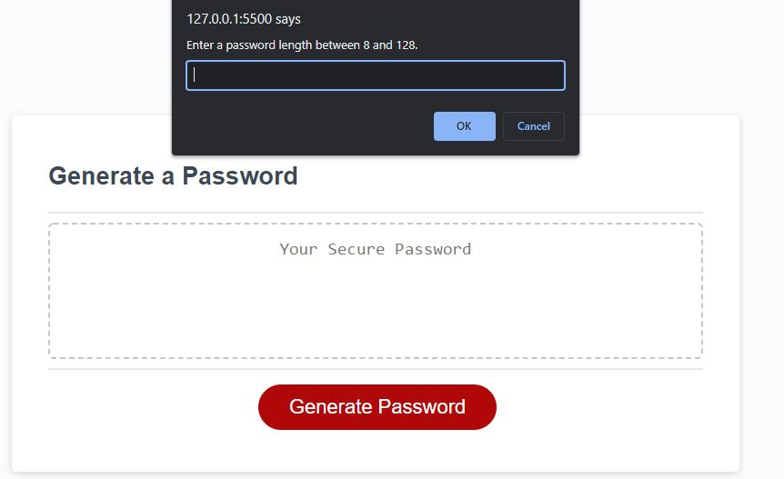
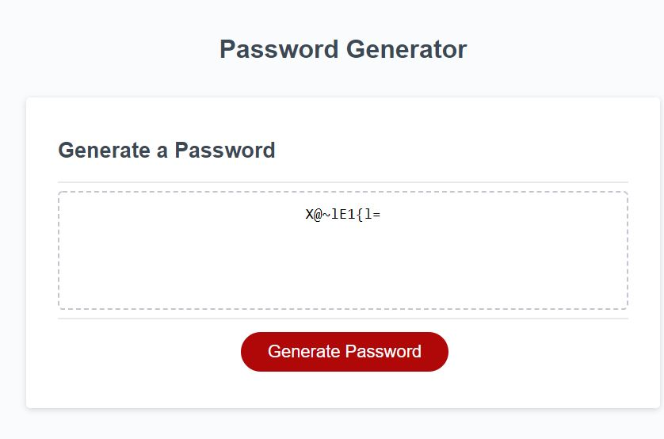
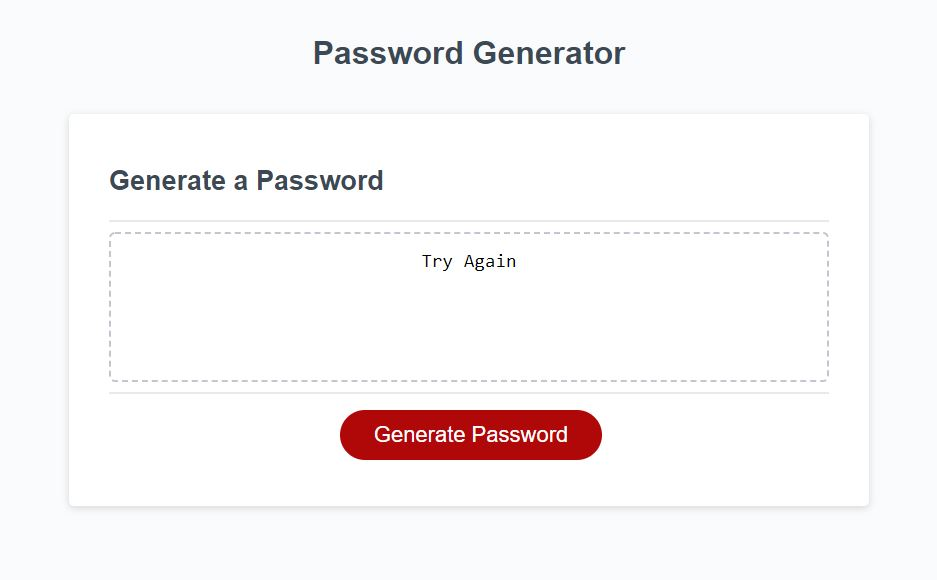

# Generate_Password

## Table of contents
* [General info](#general-info)
* [Technologies](#technologies)
* [App](#app)
* [Contact me](#contact-me)

## General info
This app generates passwords. It was made using starter code. I created the global variables, and wrote the functions that generate passwords based on user input. 

## Technologies
Project is created with:
* JavaScript
* HTML
* CSS

## App
* This is the opening view. 

* The users will be asked to answer a series of questions.

* This is an example of a generated password.  

* If the user enters unexpected input, they will see this message. 

## Contact me

* [Email: mel.chavez.code@gmail.com](mailto:mel.chavez.code@gmail.com) 
* [GitHub: 12MChavez](https://github.com/12MChavez)
